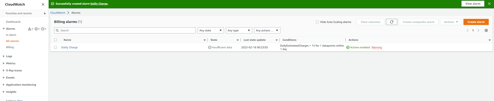
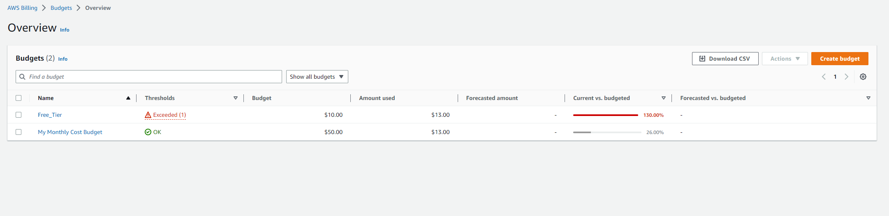
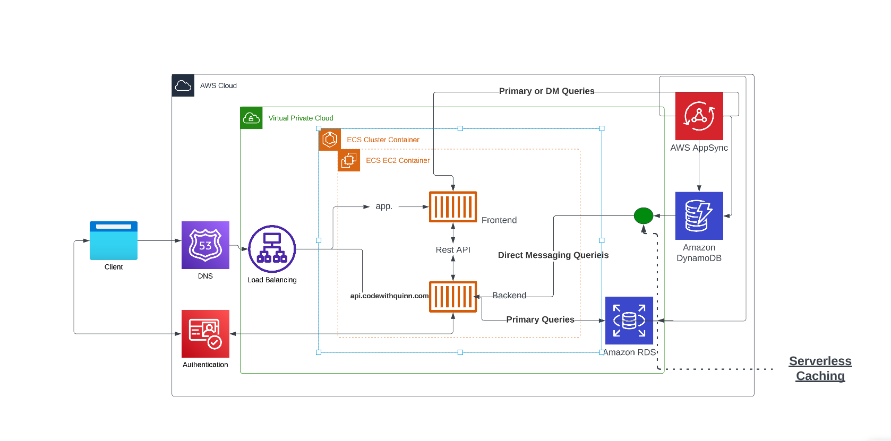

# Week 0 — Billing and Architecture

##Required Homework/ Tasks 

### Install and Verify AWS CLI

I used the required steps to use the AWS CLI and can provide proof on the picture below. I ran all commands in the AWS environment 

### Create Billing Alarm

I created a daily alarm of $10 hoping to not go over that on the monthly basis. 

### Create a budget 

Proof that another budget was created for $50 on top of the previoius budget I already had. 

### Use Cloud Shell

![Proof of cloud shell use}(assets/CLOUDSHELL.png)

Proof of using Cloudshell in the AWS platform. 

### Recreate Logical Architecture Design

Lucid charts is a great tool to use. At AWS a ton of us you draw.io but I think I like Lucid better. 

Lucid chart share Link (https://lucid.app/lucidchart/d0cdea05-a75f-46c7-a88c-103bfa5d7cff/edit?invitationId=inv_432b37af-0832-4a09-8560-febb40a331d9)

## Homework Challenges 

### NO homework challenges this week. Very new to AWS coming from a Non tech PM role at AWS. 
